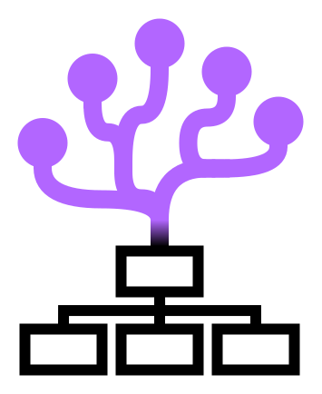

<div align="center">
    <a href="https://github.com/swanbeck/coral_cli/blob/main/"></a>
    <a href="https://github.com/swanbeck/coral_cli/releases"></a>
    <a href="https://github.com/swanbeck/coral_cli/blob/main/LICENSE"></a>
    <a href="https://github.com/swanbeck/coral_cli/blob/main/"></a>
    <a href="https://ieeexplore.ieee.org/document/11404692"></a>
    <br />
    <br />
</div>

<div align="center">
    
</div>

# Coral CLI
Coral (COmpositional Robotics Abstraction Layer) represents an effort toward truly compositional software for robotics applications. Coral draws inspiration from functional programming to create reconfigurable systems composed of modular and reusable atomic components with minimal functional interfaces. This is achieved using behavior trees and containerization.

Just as coral reefs support tremendous biodiversity (25% of marine species while covering less than 1% of the sea floor), Coral provides the scaffolding necessary to support a rich ecosystem of robotics software that enables scalable solutions across a wide range of real-world applications.

Users are referred to the [Coral Examples](https://github.com/swanbeck/coral_examples.git) for examples of practical applications enabled by Coral.

---
### Building
Before beginning, [install Go](https://go.dev/doc/install) on your system.

The easiest way to build and install the Coral CLI on Linux is by using the included [Makefile](./Makefile). Run
```
make install
```
to build the binary, place it at `/usr/local/bin/coral`, and generate and install shell completion scripts for bash, zsh, and fish. After installation, run one of the printed commands (or open a new terminal) to enable tab completion.

Verify the installation with
```
coral version
```

To uninstall, run
```
make uninstall
```

---
### Component model

A Coral component is a Docker image that carries one or more ROS2 packages and a set of metadata labels. The CLI uses these labels to orchestrate multi-component systems without any configuration beyond a standard Docker Compose file.

#### Profiles

Every Coral image must include a `coral.profile` label set to one of three values:

| Profile | Role |
|---------|------|
| `drivers` | Hardware drivers and infrastructure services |
| `skillsets` | Capability packages that export BehaviorTree.CPP plugins |
| `executors` | BT.CPP executor containers that load plugins at runtime |

#### Library export and import

Skillsets (and drivers that expose behaviors) export their compiled shared libraries by:
1. Placing `.so` files under a directory inside the image
2. Setting `ENV CORAL_EXPORT_LIB=<that directory>`
3. Ensuring the directory is world-readable: `RUN chmod o+rx <that directory>`

At launch time the CLI copies these files out of every skillset/driver image and injects them into executor containers before starting them. Executors receive the libraries via the path set by their `CORAL_IMPORT_LIB` environment variable.

Library injection is filtered for compatibility: only libraries whose `coral.btcpp_version` and `coral.ros_distro` labels match those of the target executor are injected. A warning is printed for any skipped payloads.

#### Version compatibility

The CLI checks that the major version in each image's `coral.version` label matches the CLI's own major version. Pass `--skip-version-check` to `coral launch` to bypass this check.

---
### Creating a New Component
Refer to [coral_realsense](https://github.com/swanbeck/coral_realsense) and [coral_hyla_slam](https://github.com/swanbeck/coral_hyla_slam) for complete examples of a Coral `driver` and `skillset` component, respectively.
Custom executors can be created, but the prebuilt [basic_executor](https://hub.docker.com/r/swanbeck/coral-basic_executor) (which dynamically loads behavior libraries and runs a single behavior tree to completion) will cover 99% of applications.

The `coral generate` command can be used to generate a template skeleton for a new component. Further details are provided in the following section.

To ensure proper software versioning and compatibility, components should extend one of the [Coral base images](https://hub.docker.com/u/swanbeck) hosted on Dockerhub.

| Image | Description |
|---------|------|
| `coral-base` | Base image for all other Coral images, containing only ROS and simple utilities. Common starting point for `drivers`. |
| `coral-btcpp` | Extends the base image with BehaviorTree.CPP. Common starting point for `skillsets` and `executors`. |
| `coral-cuda` | Extends the btcpp image with CUDA support. Starting point for any GPU-accelerated `drivers` or `skillsets`. |

Images are maintained for amd64 and arm64 architectures. The current image generation is v2.1.x, which are compatible with Coral CLI v2.x.x and are based on Ubuntu 22.04 with ROS2 Humble, BT.CPP 4.9.0, and CUDA 12.6.

#### Jetson Support
Because many libraries using the GPU must be built specially for Jetson devices, the base `coral-cuda` images are not Jetson-compatible
For any components that are not GPU-accelerated, `coral-base` and `coral-btcpp` are valid base images.
Special Jetson-compatible CUDA images have not yet been migrated to Coral v2.x.x, but will be hosted on Dockerhub in the near future.

---
### Commands

#### `generate` — scaffold a new component

`coral generate` creates a complete, ready-to-build skeleton for a new skillset component:

```
coral generate <name> [--output <dir>]
```

The name must be lowercase `snake_case`. The command creates a `coral_<name>/` directory containing:

- A two-stage Dockerfile (runtime base + library export stage)
- Three ROS2 packages under `src/<name>/`:
  - `<name>_interfaces` — a custom service definition
  - `<name>` — a ROS2 node that advertises that service
  - `<name>_behaviors` — a BehaviorTree.CPP plugin that calls the service
- `runtime/run.sh`, `runtime/run.launch.py`, and `runtime/default/params.yaml`
- `compose.yaml` and `.env`

The skeleton compiles and exports a working `Ping` behavior end-to-end. Every generated file contains `TODO` comments explaining what to replace. Build the result with:

```
cd coral_<name>
docker compose build
coral verify coral-<name>:v0.1.0
```

---

#### `verify` — validate a component image

`coral verify` checks whether a locally available image meets Coral's requirements:

```
coral verify <image>
```

The command checks:
1. **`coral.profile` label** is present and set to `drivers`, `skillsets`, or `executors`
2. **`CORAL_EXPORT_LIB`** — if set in the image environment:
   - The directory exists and has world read+execute permissions (`o+rx`)
   - The directory is non-empty
3. **Behavior plugin** — if the profile is `skillsets`, at least one `lib*behaviors.so` must be present under `CORAL_EXPORT_LIB`

A successful run prints a check for each step and ends with a success message:
```
[INFO] coral.profile="skillsets"
[INFO] CORAL_EXPORT_LIB=/coral_lib permissions OK (0755)
[INFO] CORAL_EXPORT_LIB=/coral_lib is populated (2 entries)
[INFO] Found behavior lib(s): libmy_component_behaviors.so
[SUCCESS] Image is compliant with Coral's standards
```

---

#### `launch` — start a Coral instance

`coral launch` starts a set of services described in a Docker Compose file in the correct order, handling library extraction and injection automatically.

```
coral launch [-f <compose.yaml>] [-g <group>] [--handle <handle>] [-d]
```

If `-f` is not provided, the CLI looks for `compose.yaml`, `docker-compose.yaml`, `compose.yml`, or `docker-compose.yml` in the current directory.

**Launch sequence:**
1. Validates that all images are present locally and have a valid `coral.profile` label
2. Extracts shared libraries from every skillset and driver image into a staging directory
3. Starts `drivers` and `skillsets` using `docker compose up`
4. Waits for all drivers and skillsets with Docker health checks to report healthy (up to `--health-timeout` seconds, default 120)
5. Creates executor containers, injects compatible libraries into each one, then starts them

**Compose file format:**

Each service needs only an `image:` field (and any runtime configuration). The CLI reads the `coral.profile` label from the image to determine start order — no `profiles:` key is needed in the compose file itself.

```yaml
services:
  my_slam:
    image: my_organization/coral-my_slam:v1.0.0
    network_mode: host
    ipc: host

  my_runner:
    image: swanbeck/coral-basic_executor:v2.1.1
    environment:
      BT_FILE: /path/to/behavior_tree.xml
    network_mode: host
    ipc: host
```

**Key flags:**

| Flag | Default | Description |
|------|---------|-------------|
| `-f, --compose-file` | auto-detect | Path to compose file |
| `--env-file` | auto-detect | Path to `.env` file for variable substitution |
| `-g, --group` | `coral` | Group label for this instance |
| `--handle` | — | Optional unique handle |
| `-d, --detached` | `false` | Run in background |
| `--lib-dir` | `$CORAL_LIB` or `./lib` | Directory for extracted library staging |
| `--executor-delay` | `0` | Additional seconds to wait after health check before starting executors |
| `--health-timeout` | `120` | Seconds to wait for health checks to pass before starting executors |
| `-p, --profile` | all | Launch only the specified profile(s) |
| `--skip-version-check` | `false` | Skip `coral.version` major-version check |

**Library staging directory:**

The CLI resolves the staging path in this order: `--lib-dir` flag → `$CORAL_LIB` environment variable → `./lib` (created automatically). The directory holds staging subdirectories and a `registry.json` that reference-counts which instances hold each extracted library tree. Staging directories are removed automatically when the last instance that references them shuts down.

**Running the CLI inside Docker:**

When the CLI itself runs inside a container, Docker volume mounts in compose files use host paths that differ from container paths. Set these additional environment variables:

```
CORAL_IS_DOCKER=true
CORAL_HOST_LIB=/absolute/path/on/host/to/lib   # host-side path matching CORAL_LIB
```

**Example output (detached):**
```
[INFO] Launching new instance coral-d3db75df
[INFO] Starting skillsets (2): [my_slam my_other_skill]
[+] Running 2/2
 ✔ Container coral-d3db75df-my_slam-1          Started
 ✔ Container coral-d3db75df-my_other_skill-1   Started
[INFO] Waiting for drivers and skillsets to become healthy...
[INFO] Starting executors (1): [my_runner]
[INFO] Injected 3 libraries into executor my_runner
[+] Running 1/1
 ✔ Container coral-d3db75df-my_runner-1        Started
```
---

#### `shutdown` — stop a Coral instance

`coral shutdown` stops and cleans up instances launched with `coral launch`.

```
coral shutdown --name <name>
coral shutdown --handle <handle>
coral shutdown -g <group>
coral shutdown -a
```

| Flag | Description |
|------|-------------|
| `-n, --name` | Stop the instance with this generated name |
| `--handle` | Stop the instance with this handle |
| `-g, --group` | Stop all instances in this group |
| `-a, --all` | Stop all tracked instances |
| `--kill` | Forcefully kill containers before removing (default: true) |

Shutdown reads instance metadata stored in `~/.coral_cli/instances/`. Foreground instances (launched without `-d`) clean up their own metadata when they exit; only detached instances need an explicit `coral shutdown`.

---

#### `tail` — stream logs from running instances

`coral tail` attaches to the logs of one or more running Coral instances, color-coding each container's output by service name.

```
coral tail -a
coral tail -n <name> [-n <name2> ...]
coral tail -g <group>
coral tail --handle <handle>
```

Press `Ctrl+C` to detach without stopping the instance.

---

#### `inspect` — display a component's behavior manifest

`coral inspect` loads any behavior plugins from a component image and prints the registered BehaviorTree.CPP node types along with their ports and metadata.

```
coral inspect <image> [--format json|markdown] [-o <output-file>]
```

The default format is markdown. Pass `--format json` for machine-readable output, or `-o <file>` to write to a file instead of stdout.

> **Note:** Full behavior introspection requires `coral.version >= v2.1.1` within components.

---

#### `images` and `ps` — filtered Docker views

`coral images` lists only Docker images whose repository name starts with `coral`:

```
coral images [<docker images flags>]
```

`coral ps` lists only running containers whose image starts with `coral`:

```
coral ps [<docker ps flags>]
```

All other Docker subcommands are passed through to Docker directly, e.g. `coral pull`, `coral rmi`.

---
### Citation
If you find Coral useful in your work, please consider citing our paper:
```
@inproceedings{swanbeck_coral_2026,
    author={Swanbeck, Steven and Pryor, Mitch},
    booktitle={2026 IEEE/SICE International Symposium on System Integration (SII)}, 
    title={CORAL: A Unifying Abstraction Layer for Compositional Robotics Software}, 
    year={2026},
    pages={956-963},
    doi={10.1109/SII64115.2026.11404692}
}
```
